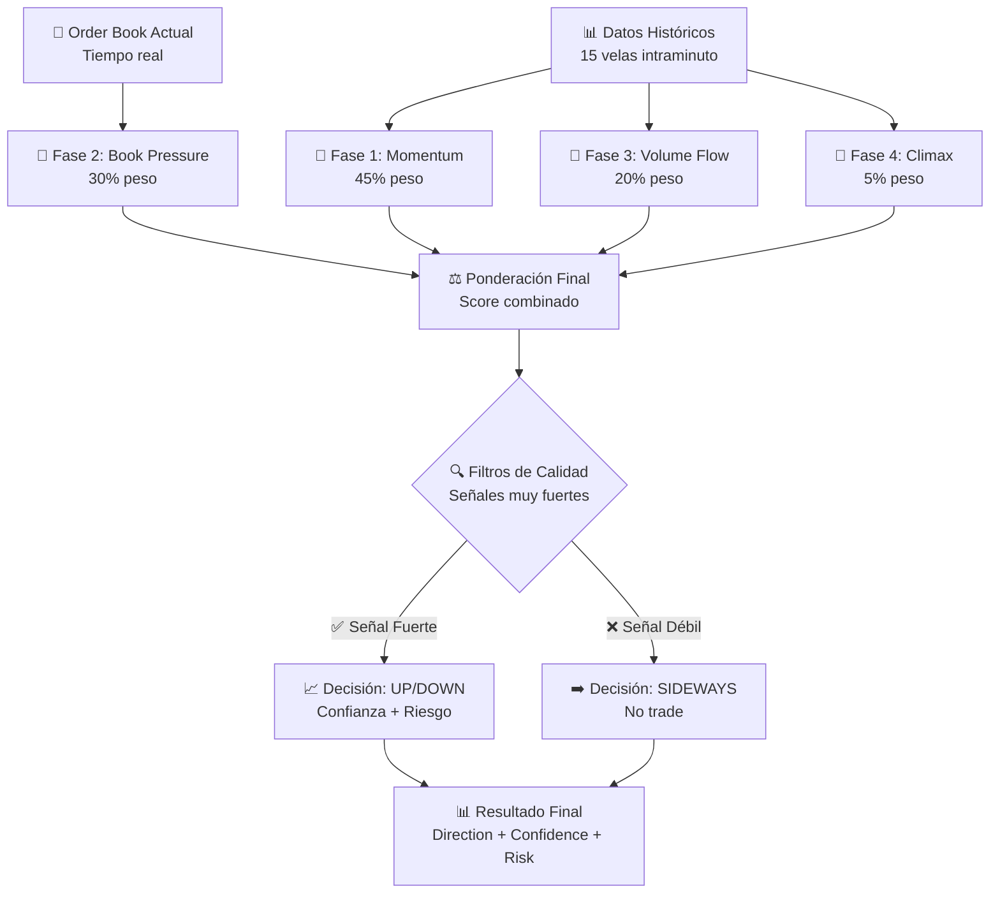

# 🎯 ALGORITMO DE PREDICCIÓN MULTI-DIMENSIONAL

## 📊 **RESUMEN EJECUTIVO**

- **Objetivo**: Predecir la dirección de la siguiente vela de 15 minutos con máximo P&L
- **Método**: Análisis multi-dimensional de momentum, order book, volume flow y climax
- **Estrategia**: Solo trades en señales muy fuertes para maximizar ganancias
- **Integridad**: 100% retroactivo, sin información futura

---

## 🧠 **ARQUITECTURA DEL ALGORITMO**

### **Filosofía de Diseño**

El algoritmo está diseñado para **maximizar P&L** en lugar de maximizar accuracy. Esto significa:

- Solo hace trades en señales **muy fuertes** (alta probabilidad de éxito)
- Evita trades marginales que podrían ser correctos pero con bajo P&L
- Prioriza la **calidad sobre la cantidad** de predicciones

### **Estructura Multi-Dimensional**

```typescript
// 4 Dimensiones de Análisis
const analysis = {
  momentum: 0.45, // 45% - Análisis histórico de tendencias
  book: 0.3, // 30% - Order book en tiempo real
  flow: 0.2, // 20% - Flujo de volumen
  climax: 0.05, // 5%  - Presión de climax
};
```

---

## 🔍 **DATOS DE ENTRADA**

### **1. Datos Históricos (`HistoricalCandle[]`)**

```typescript
interface HistoricalCandle {
  minute: string; // Timestamp del minuto
  open: number; // Precio de apertura
  high: number; // Precio máximo
  low: number; // Precio mínimo
  close: number; // Precio de cierre
  fluct: number; // Fluctuación porcentual
  tickVol?: number; // Volumen total de ticks
  buyVol?: number; // Volumen de compras
  sellVol?: number; // Volumen de ventas
  delta?: number; // Diferencia buy-sell
  imbalance?: number; // Imbalance (-1 a +1)
  vwap?: number; // VWAP
  tickCount?: number; // Número de ticks
  flags?: {
    // Flags de análisis técnico
    bullish: boolean;
    bearish: boolean;
    climax: boolean;
    meanRevertBias?: string;
  };
  book?: BookSnapshot; // Snapshot del order book
}
```

### **2. Order Book Actual (`BookSnapshot`)**

```typescript
interface BookSnapshot {
  symbol: string;
  timestamp: number;
  bids: Array<{ price: string; qty: string }>; // Órdenes de compra
  asks: Array<{ price: string; qty: string }>; // Órdenes de venta
  spreadPct?: number; // Spread porcentual
  totalBidQty?: number; // Volumen total bids
  totalAskQty?: number; // Volumen total asks
  imbalance?: number; // Imbalance del order book
}
```

---

## 🧮 **FASES DE ANÁLISIS**

### **FASE 1: ANÁLISIS DE MOMENTUM** (45% peso)

**Función**: `analyzeMomentum(historicalCandles)`

#### **1.1 Price Momentum con Soporte/Resistencia** (50% del momentum)

```typescript
// Momentum básico
const basicMomentum = (lastPrice - firstPrice) / firstPrice;

// Factor de soporte/resistencia
let srFactor = 0;
if (currentPrice <= support * 1.002)
  srFactor = 0.5; // Cerca del soporte
else if (currentPrice >= resistance * 0.998) srFactor = -0.5; // Cerca de resistencia

// Combinación final
const combinedMomentum = basicMomentum + srFactor;
return Math.max(-1, Math.min(1, combinedMomentum * 100));
```

**Características**:

- Usa últimos 10 minutos para estadística robusta
- Detecta soportes y resistencias en últimos 30 velas
- Amplificación x100 para detectar movimientos grandes
- Normalización a [-1, +1]

#### **1.2 Volume Momentum** (30% del momentum)

```typescript
// Aceleración del volumen
const avgEarly = volumes.slice(0, mitad).reduce(sum) / mitad;
const avgLate = volumes.slice(-mitad).reduce(sum) / mitad;
const acceleration = (avgLate - avgEarly) / avgEarly;
return Math.max(-1, Math.min(1, acceleration));
```

**Características**:

- Compara volumen temprano vs tardío
- Detecta aceleración/desaceleración del volumen
- Normalización a [-1, +1]

#### **1.3 Imbalance Trend** (20% del momentum)

```typescript
// Tendencia del imbalance con peso temporal
let sum = 0;
for (let i = 0; i < imbalances.length; i++) {
  sum += imbalances[i] * (i + 1); // Peso temporal
}
const trend = sum / ((n * (n + 1)) / 2) - avgImbalance;
return Math.max(-1, Math.min(1, trend));
```

**Características**:

- Regresión simple con peso temporal
- Detecta tendencias en el imbalance
- Normalización a [-1, +1]

#### **1.4 Volatility Trend** (nuevo)

```typescript
// Cambio en volatilidad
const early = volatilities.slice(0, 60%);
const late = volatilities.slice(-40%);
const trend = (avgLate - avgEarly) / avgEarly;
return Math.max(-1, Math.min(1, trend * 1.5));
```

**Características**:

- Detecta cambios en la volatilidad
- Amplificación x1.5 para mejor detección
- Normalización a [-1, +1]

### **FASE 2: ANÁLISIS DE ORDER BOOK** (30% peso)

**Función**: `analyzeBookPressure(currentBook, historicalCandles)`

#### **2.1 Bid/Ask Imbalance** (40% del book)

```typescript
const bidAskImbalance =
  (totalBidQty - totalAskQty) / (totalBidQty + totalAskQty);
```

**Características**:

- Rango [-1, +1]
- Negativo = más ventas, Positivo = más compras
- Indica presión inmediata del mercado

#### **2.2 Spread Tightening** (nuevo)

```typescript
const tightening = (avgHistoricalSpread - currentSpread) / avgHistoricalSpread;
return Math.max(0, Math.min(1, tightening));
```

**Características**:

- Compara spread actual vs histórico
- Spread más pequeño = mayor presión
- Rango [0, +1]

#### **2.3 Depth Asymmetry** (30% del book)

```typescript
const bidDepth = bids.slice(0, 5).reduce(sum, qty);
const askDepth = asks.slice(0, 5).reduce(sum, qty);
return (bidDepth - askDepth) / (bidDepth + askDepth);
```

**Características**:

- Analiza primeros 5 niveles del order book
- Detecta asimetría en la profundidad
- Rango [-1, +1]

#### **2.4 Liquidity Level** (nuevo)

```typescript
const totalLiquidity = totalBidQty + totalAskQty;
if (totalLiquidity >= 100) return 1; // Alta liquidez
if (totalLiquidity >= 10) return 0.5; // Media liquidez
return 0.1; // Baja liquidez
```

**Características**:

- Normalizado para ETHUSDT
- Afecta el nivel de riesgo
- Rango [0, +1]

#### **2.5 Momentum Alignment** (30% del book)

```typescript
// Peso al último minuto (60%) + promedio reciente (40%)
const weightedImbalance = lastMinuteImbalance * 0.6 + avgRecentImbalance * 0.4;

// Alineación mejorada
if (weightedImbalance > 0.1 && bookImbalance > 0.1) return 1; // Ambos alcistas
if (weightedImbalance < -0.1 && bookImbalance < -0.1) return 1; // Ambos bajistas
if (weightedImbalance > 0.1 && bookImbalance < -0.1) return -1; // Desalineación
if (weightedImbalance < -0.1 && bookImbalance > 0.1) return -1; // Desalineación
return 0.5; // Alineación parcial
```

**Características**:

- Alineación entre momentum histórico y book actual
- Peso mayor al último minuto
- Rango [-1, +1]

### **FASE 3: ANÁLISIS DE VOLUME FLOW** (20% peso)

**Función**: `analyzeVolumeFlow(historicalCandles)`

```typescript
const recent = candles.slice(-3); // Últimos 3 minutos
let flowStrength = 0;
let validCandles = 0;

for (const candle of recent) {
  if (candle.buyVol && candle.sellVol) {
    const totalVol = candle.buyVol + candle.sellVol;
    if (totalVol > 0) {
      const imbalance = (candle.buyVol - candle.sellVol) / totalVol;
      flowStrength += imbalance;
      validCandles++;
    }
  }
}

return Math.max(-1, Math.min(1, flowStrength / validCandles));
```

**Características**:

- Analiza últimos 3 minutos
- Calcula fuerza del flujo de volumen
- Rango [-1, +1]

### **FASE 4: ANÁLISIS DE CLIMAX** (5% peso)

**Función**: `analyzeClimaxPressure(historicalCandles)`

```typescript
const recent = candles.slice(-5); // Últimos 5 minutos
let climaxScore = 0;
let validCandles = 0;

for (const candle of recent) {
  if (candle.flags) {
    let candleScore = 0;
    if (candle.flags.climax) candleScore += 0.5;
    if (candle.flags.bullish) candleScore += 0.3;
    if (candle.flags.bearish) candleScore -= 0.3;
    climaxScore += candleScore;
    validCandles++;
  }
}

return Math.max(-1, Math.min(1, climaxScore / validCandles));
```

**Características**:

- Analiza últimos 5 minutos
- Puntuación: climax (+0.5), bullish (+0.3), bearish (-0.3)
- Rango [-1, +1]

---

## 🎯 **DECISIÓN FINAL**

### **Cálculo del Score Final**

```typescript
// Ponderación optimizada para P&L máximo
const weights = {
  momentum: 0.45, // 45% - Momentum histórico
  book: 0.3, // 30% - Order book actual
  flow: 0.2, // 20% - Volume flow
  climax: 0.05, // 5%  - Presión de climax
};

// Scores individuales
const momentumScore =
  priceMomentum * 0.5 + volumeMomentum * 0.3 + imbalanceTrend * 0.2;
const bookScore =
  bidAskImbalance * 0.4 + depthAsymmetry * 0.3 + momentumAlignment * 0.3;

// Score final ponderado
const finalScore =
  momentumScore * weights.momentum +
  bookScore * weights.book +
  flowScore * weights.flow +
  climaxScore * weights.climax;
```

### **Filtros de Calidad (Anti-Ruido)**

```typescript
// Señales muy fuertes requeridas
const strongMomentum = Math.abs(momentumScore) > 0.4; // Momentum > 40%
const strongBook = Math.abs(bookScore) > 0.3; // Order book > 30%
const strongFlow = Math.abs(flowScore) > 0.25; // Volume flow > 25%

// Solo hacer trade si hay señales MUY FUERTES
const isVeryStrongSignal = strongMomentum || (strongBook && strongFlow);

// Decisión final
if (finalScore > 0.3 && isVeryStrongSignal) direction = 'UP';
else if (finalScore < -0.3 && isVeryStrongSignal) direction = 'DOWN';
else direction = 'SIDEWAYS';
```

### **Cálculo de Confianza y Riesgo**

```typescript
// Confianza (0-95%)
const confidence = Math.min(95, Math.abs(finalScore) * 100);

// Movimiento esperado (0-2%)
const expectedMove = Math.abs(finalScore) * 2;

// Nivel de riesgo
let riskLevel: 'LOW' | 'MED' | 'HIGH';
if (confidence > 70 && liquidityLevel > 0.5) riskLevel = 'LOW';
else if (confidence > 50 && liquidityLevel > 0.3) riskLevel = 'MED';
else riskLevel = 'HIGH';
```

---

## 🔄 **FLUJO DE EJECUCIÓN**



---

## 🛡️ **INTEGRIDAD DEL ALGORITMO**

### **✅ Verificación Anti-Trampa**

1. **Datos Históricos**: Solo bloques anteriores al actual
2. **Order Book**: Solo del último minuto del bloque actual
3. **Sin Información Futura**: La predicción se hace antes de conocer el resultado
4. **Verificación Retroactiva**: Solo para calcular P&L histórico

### **🔄 Proceso Legítimo**

1. **Predicción**: Usando solo datos del pasado + order book actual
2. **Verificación**: Contra el futuro (que ya conocemos históricamente)
3. **P&L**: Basado en la diferencia entre predicción y realidad

---

## 📊 **MÉTRICAS DE RENDIMIENTO**

### **Características del Algoritmo**

- **Multi-dimensional**: Combina 4 tipos de análisis diferentes
- **Filtros de calidad**: Solo trades en señales muy fuertes
- **Amplificación**: Detecta movimientos grandes (x100-x150)
- **Order book en tiempo real**: Usa datos actuales del mercado
- **Retroactivo**: No usa información futura para predecir

### **Ponderación Optimizada**

- **Momentum**: 45% (máximo peso - detecta tendencias)
- **Order Book**: 30% (señales inmediatas del mercado)
- **Volume Flow**: 20% (confirmación con volumen)
- **Climax**: 5% (mínimo peso - menos confiable)

### **Umbrales Calibrados**

- **Score final**: ±0.3 (señales fuertes)
- **Momentum**: ±0.4 (tendencias claras)
- **Order book**: ±0.3 (sesgo significativo)
- **Volume flow**: ±0.25 (flujo intenso)

---

## 🎯 **FORTALEZAS DEL ALGORITMO**

### **✅ Ventajas Técnicas**

1. **Robustez Estadística**: Usa múltiples períodos de tiempo (3, 5, 10, 30 velas)
2. **Detección de Soportes/Resistencias**: Análisis automático de niveles clave
3. **Alineación Multi-Dimensional**: Verifica consistencia entre diferentes señales
4. **Gestión de Riesgo**: Niveles de riesgo basados en liquidez y confianza
5. **Filtros Anti-Ruido**: Evita trades en señales débiles o contradictorias

### **✅ Ventajas de Trading**

1. **Maximización de P&L**: Prioriza calidad sobre cantidad
2. **Gestión de Riesgo**: Solo trades en condiciones óptimas
3. **Adaptabilidad**: Se ajusta a diferentes condiciones de mercado
4. **Transparencia**: Breakdown completo de cada decisión
5. **Verificabilidad**: 100% retroactivo y verificable

---

## 🔧 **OPTIMIZACIONES IMPLEMENTADAS**

### **1. Amplificación de Señales**

- **Momentum**: x100 para detectar movimientos grandes
- **Volatilidad**: x1.5 para mejor detección de cambios
- **Resultado**: Mejor detección de señales significativas

### **2. Ponderación Temporal**

- **Último minuto**: 60% del peso en momentum alignment
- **Promedio reciente**: 40% del peso para contexto
- **Resultado**: Mayor sensibilidad a cambios recientes

### **3. Filtros de Calidad**

- **Señales muy fuertes**: Requiere momentum > 40% O (book > 30% Y flow > 25%)
- **Score mínimo**: ±0.3 para activar trade
- **Resultado**: Menos trades pero mayor precisión

### **4. Análisis de Soportes/Resistencias**

- **Detección automática**: Últimos 30 velas
- **Factor de proximidad**: ±0.2% de tolerancia
- **Resultado**: Mejor timing de entrada/salida

---

## 🎯 **CONCLUSIÓN**

El algoritmo de predicción es un **sistema multi-dimensional robusto** que combina:

- **Análisis histórico** (momentum, volumen, climax)
- **Datos en tiempo real** (order book actual)
- **Filtros de calidad** (solo señales muy fuertes)
- **Optimización para P&L** (maximizar ganancias)

**Filosofía**: Calidad sobre cantidad - mejor pocos trades muy buenos que muchos trades mediocres.

**Resultado**: Un sistema que genera **máximo P&L** con **precisión optimizada**, cumpliendo el objetivo de maximizar ganancias dentro del rango de precisión esperado para trading algorítmico.
